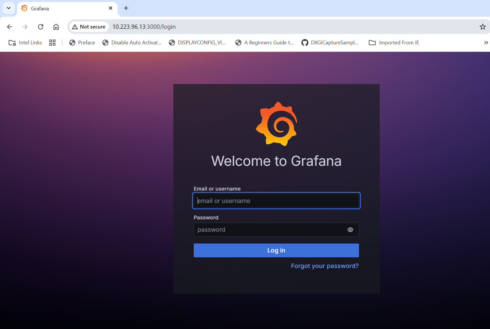

# Get Started

-   **Time to Complete:** 30 minutes
-   **Programming Language:**  Python 3

## Prerequisites

- [System Requirements](system-requirements.md)


## Docker Configuration

1. **Run Docker as Non-Root**: Follow the steps in [Manage Docker as a non-root user](https://docs.docker.com/engine/install/linux-postinstall/#manage-docker-as-a-non-root-user).
2. **Configure Proxy (if required)**:
   - Set up proxy settings for Docker client and containers as described in [Docker Proxy Configuration](https://docs.docker.com/network/proxy/).
   - Example `~/.docker/config.json`:
     ```json
     {
       "proxies": {
         "default": {
           "httpProxy": "http://<proxy_server>:<proxy_port>",
           "httpsProxy": "http://<proxy_server>:<proxy_port>",
           "noProxy": "127.0.0.1,localhost"
         }
       }
     }
     ```
   - Configure the Docker daemon proxy as per [Systemd Unit File](https://docs.docker.com/engine/daemon/proxy/#systemd-unit-file).
3. **Enable Log Rotation**:
   - Add the following configuration to `/etc/docker/daemon.json`:
     ```json
     {
       "log-driver": "json-file",
       "log-opts": {
         "max-size": "10m",
         "max-file": "5"
       }
     }
     ```
   - Reload and restart Docker:
     ```bash
     sudo systemctl daemon-reload
     sudo systemctl restart docker
     ```

## Build Docker Images

Navigate to the application directory and build the Docker images:

```bash
make build
```

## Deploy with Docker Compose (Single Node)

1. Update the following fields in `.env`:
   - `INFLUXDB_USERNAME`
   - `INFLUXDB_PASSWORD`
   - `VISUALIZER_GRAFANA_USER`
   - `VISUALIZER_GRAFANA_PASSWORD`
   - `MR_PSQL_PASSWORD`
   - `MR_MINIO_ACCESS_KEY`
   - `MR_MINIO_SECRET_KEY`

2. Deploy the sample app, use only one of the options below:
   - **Using OPC-UA ingestion**:
     ```bash
     make up_opcua_ingestion
     ```
   - **Using MQTT ingestion**:
     ```bash
     make up_mqtt_ingestion
     ```

Use the following command to verify that all containers are active and error-free.

> **Note:** The command `make status` may show errors in containers like ia-grafana when user have not logged in
> for the first login OR due to session timeout. Just login again in Grafana and functionality wise if things are working, then
> please ignore `user token not found` errors along with other minor errors which may show up in Grafana logs.


```sh
make status
```

> **Note:** The `kapacitor_devmode.conf` files would be auto-updated to run the configured tasks and udfs from the Time Series Analytics microservice `time_series_analytics_microservice/config.json`.

## Verify the Wind Turbine Anomaly Detection Results

1.  Run below commands to see the data in InfluxDB*:

    > **NOTE**:
    > Please ignore the error message `There was an error writing history file: open /.influx_history: read-only file system` happening in the InfluxDB shell.
    > This does not affect any functionality while working with the InfluxDB commands

    ``` bash
    docker exec -it ia-influxdb bash
    # For below command, the INFLUXDB_USERNAME and INFLUXDB_PASSWORD needs to be fetched from `.env` file
    # Use the below command while working in secure mode
    influx -ssl -unsafeSsl -username <username> -password <passwd>
    # Use the below command while working in insecure mode
    influx -username <username> -password <passwd> 
    use datain # database access
    show measurements
    # Run below query to check and output measurement processed
    # by Time Series Analytics microservice
    select * from wind_turbine_anomaly_data
    ```

2. To check the output in Grafana, follow the below steps.

    - Use link `http://<host_ip>:3000` to launch Grafana from browser (preferably, chrome browser)
    
    - Login to the Grafana with values set for `VISUALIZER_GRAFANA_USER` and `VISUALIZER_GRAFANA_PASSWORD`
      in `.env` file and select **Wind Turbine Dashboard**.

      

    - After login, click on Dashboard 
      

    - Select the `Wind Turbine Dashboard`.
      

    - One will see the below output.
  
      

## Troubleshooting

- Check container logs in docker compose deployment:

  ```bash
  docker logs -f <container_name>
  docker logs -f <container_name> | grep -i error
  ```


## Supporting Resources

* [Overview](Overview.md)
* [System Requirements](system-requirements.md)
