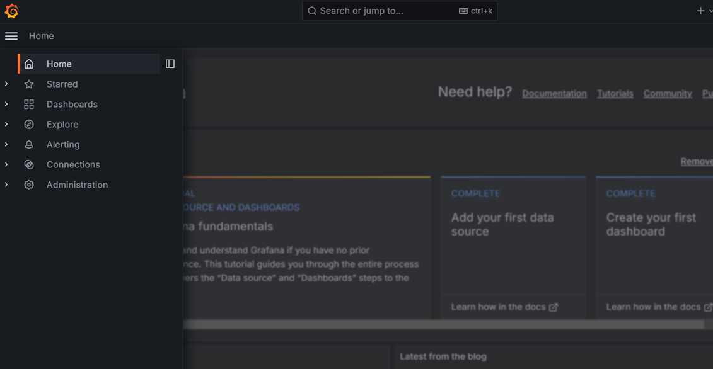
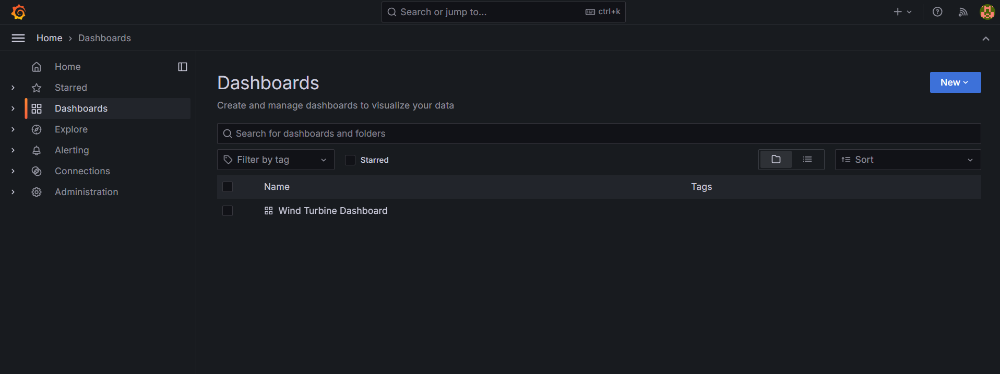
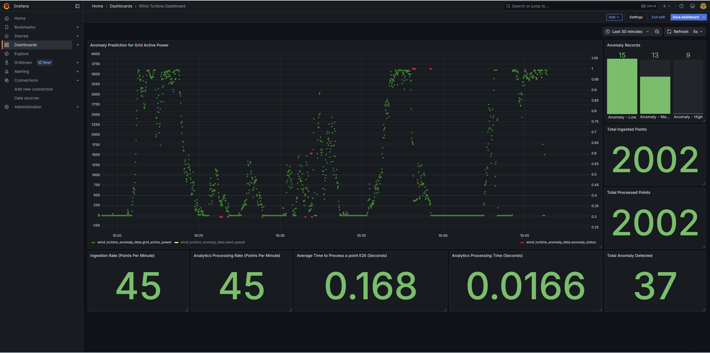

# How to Deploy with Helm

-   **Time to Complete:** 30 minutes
-   **Programming Language:**  Python 3

## Get Started

Complete this guide to confirm that your setup is working correctly and try out workflows in the sample application.

## Prerequisites

- [System Requirements](system-requirements.md)
-  K8s installation on single or multi node must be done as pre-requisite to continue the following deployment. Note: The kubernetes cluster is set up with `kubeadm`, `kubectl` and `kubelet` packages on single and multi nodes with `v1.30.2`.
  Refer to tutorials such as <https://adamtheautomator.com/installing-kubernetes-on-ubuntu> and many other
  online tutorials to setup kubernetes cluster on the web with host OS as ubuntu 22.04.
- For helm installation, refer to [helm website](https://helm.sh/docs/intro/install/)

> **Note**
> If Ubuntu Desktop is not installed on the target system, follow the instructions from Ubuntu to [install Ubuntu desktop](https://ubuntu.com/tutorials/install-ubuntu-desktop).

## Generate or Download the helm chart

- Using pre-built helm charts:

    Follow this procedure on the target system to install the package.

    1. Download helm chart with the following command

        `helm pull oci://amr-registry.caas.intel.com/edge-insights/timeseries/wind-turbine-anomaly-detection-sample-app --version 1.0.0`

    2. unzip the package using the following command

        `tar -xvzf wind-turbine-anomaly-detection-sample-app-1.0.0.tgz`

    - Get into the helm directory

        `cd wind-turbine-anomaly-detection-sample-app-1.0.0`

- Generate the helm charts
   
    ```bash
    make gen_helm_charts
    ```

## Configure and update the environment variables

1. Update the below fields in `values.yaml` file in the helm chart

    ``` sh
    INFLUXDB_USERNAME:
    INFLUXDB_PASSWORD:
    VISUALIZER_GRAFANA_USER:
    VISUALIZER_GRAFANA_PASSWORD:
    POSTGRES_PASSWORD: # example: POSTGRES_PASSWORD: intel1234
    MINIO_ACCESS_KEY: # example: MINIO_ACCESS_KEY: intel1234
    MINIO_SECRET_KEY: # example: MINIO_SECRET_KEY: intel1234
    http_proxy: # example: http_proxy: http://proxy.example.com:891
    https_proxy: # example: http_proxy: http://proxy.example.com:891
    ```

## Install Helm charts - use only one of the options below:

> **Note:**
> 1. Please uninstall the helm charts if already installed.
> 2. If the worker nodes are running behind proxy server, then please additionally set env.HTTP_PROXY and env.HTTPS_PROXY env like the way env.TELEGRAF_INPUT_PLUGIN is being set below with helm install command

- OPC-UA ingestion flow:

    ```bash
    helm install ts-wind-turbine-anomaly --set env.TELEGRAF_INPUT_PLUGIN=opcua . -n apps --create-namespace
    ```

- MQTT ingestion flow:

    ```bash
    helm install ts-wind-turbine-anomaly --set env.TELEGRAF_INPUT_PLUGIN=mqtt_consumer . -n apps --create-namespace
    ```

## Verifying pods and services:

```bash
kubectl get pods -n apps
kubectl get svc -n apps
```

## Access Grafana

   - URL: `http://<system_ip>:30001`
   - Login with credentials from `values.yaml`.
   - After login, click on Dashboard 
     

   - Select the `Wind Turbine Dashboard`.
     

   - One will see the below output.
  
     


## End the demonstration

Follow this procedure to stop the sample application and end this demonstration.

1. Stop the sample application with the following command that uninstalls the release.

    ```sh
    helm uninstall ts-wind-turbine-anomaly -n apps
    ```


2. Confirm the pods are no longer running.

    ```sh
    kubectl get pods -n apps
    ```

### Error Logs

View the container logs using this command.

    kubectl logs -f <pod_name> -n apps
